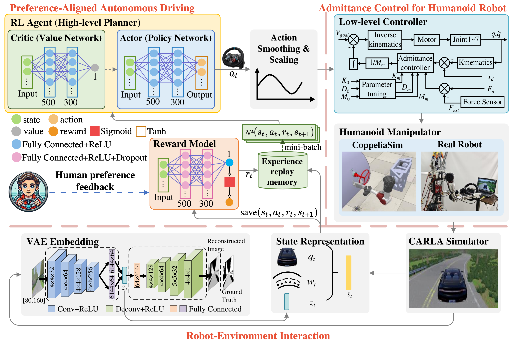
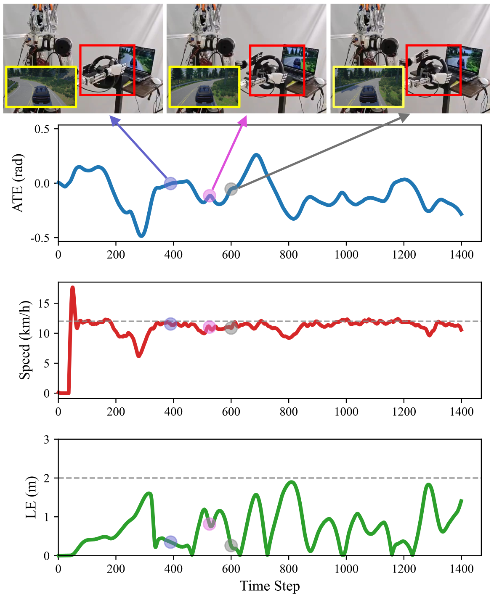

# DRIVE: A Unified Framework for Empowering Personalized Autonomous Driving with Humanoid Robots

### Project Page | [Video](https://www.dropbox.com/scl/fi/1wvjw9ytll4ripxd5u6rb/drive.mp4?rlkey=ieb1meyzxvyp3h54vslaxl7ie&st=trcvi0mw&dl=0)

### Overview

**The hybrid control framework of DRIVE** 

<div align=center>
 
</div>


**The main contributions of this work can be summarized as follows:** 

- End-to-end learning with embedded admittance control and preference adaptation.
- Pioneering joint simulation framework for humanoid-driven vehicles.
- Comprehensive sim-to-real validation and performance analysis.


### Hyperparameters and Values

| Hyperparameter | Values |
| ----------- | ----------- |
| batch size | 2048 |
| minibatch size | 64 |
| learning rate | 0.0001 |
| GAE parameter $\lambda$ | 0.95 |
| discount factor $\gamma$ | 0.99 |
| clipping factor $\epsilon$ | 0.2 |
| number of optimization objectives $M$ | 2 (lateral error and target speed) |
| number of reward models $K$ | 3 |
| reward model initial weight $\beta_0$ | 0.05 |
| weight decay rate $\rho$ | 0.001 |
| smoothing factor $\alpha$ | 0.9 |
| interial coefficients $M_0$ | $[1,1,1,1,1,1]$ |
| damping coefficients $D_0$ | $[0.1,0.1,0.1,5.5,5.5,5.5]$ |
| stiffness coeefficients $K_0$ | $[500,500,500,500,500,500]$ |
| control period $\Delta t$ | 0.01 |
| PPO decision period | $1/15$ |
| steering radius $R$ | 0.23 |

### Install

Suppose your folder name is Coppeliasim_Carla.

Download

```
git clone https://github.com/nubot-nudt/DRIVE.git
```

1、ROS-Noetic

```
wget http://fishros.com/install -O fishros && . fishros
```

2、Third-party library

```
sudo ln -s /usr/bin/python3 /usr/bin/python
sudo apt-get install ros-noetic-tf2-sensor-msgs ros-noetic-serial ros-noetic-derived-object-msgs ros-noetic-ackermann-msgs
sudo apt install xsltproc
```

3、Conda Virtual Environment

```
conda create -n carla_py35 python==3.5.5
pip install --upgrade pip
pip install -r requirements.txt
```

4、Coppeliasim V4.1.0

```
echo 'export COPPELIASIM_ROOT_DIR=~/Coppeliasim_Carla/Coppeliasim/src/CoppeliaSim_Edu_V4_1_0_Ubuntu20_04' >> ~/.bashrc
source ~/.bashrc

cd Coppeliasim
catkin build

cp ~/Coppeliasim_Carla/Coppeliasim/devel/lib/libsimExtROSInterface.so ~/Coppeliasim_Carla/Coppeliasim/src/CoppeliaSim_Edu_V4_1_0_Ubuntu20_04/
```

5、Robcup_2022

Modify the header file reference directory in the **Robcup_2022/ROS_Code/src/innfos_control/src/innfos_control.cpp** / **Robcup_2022/ROS_Code/src/innfos_control_7r/src/innfos_control_7r.cpp** file

Compile
```
cd ~/Coppeliasim_Carla/Robcup_2022/ROS_Code
catkin build

cd ~/Coppeliasim_Carla/Robcup_2022/TL_Code
catkin_make

echo 'source ~/Coppeliasim_Carla/Robcup_2022/TL_Code/devel/setup.bash' >> ~/.bashrc
```

6、Carla 0.9.5

Download [CARLA_0.9.5.tar.gz、Town06_0.9.5.tar.gz and Town07_0.9.5.tar.gz](https://github.com/carla-simulator/carla/releases/tag/0.9.5).

```
mkdir -p ~/Coppeliasim_Carla/carla_0_9_5
tar -xzf CARLA_0.9.5.tar.gz -C ~/Coppeliasim_Carla/carla_0_9_5 --strip-components=1

tar -xzf Town06_0.9.5.tar.gz --overwrite -C ~/Coppeliasim_Carla/carla_0_9_5
tar -xzf Town07_0.9.5.tar.gz --overwrite -C ~/Coppeliasim_Carla/carla_0_9_5

cd ~/Coppeliasim_Carla/carla_0_9_5/PythonAPI/carla/dist
conda activate carla_py35
easy_install carla-0.9.5-py3.5-linux-x86_64.egg

echo 'export CARLA_ROOT=~/Coppeliasim_carla/carla_0_9_5' >> ~/.bashrc
echo 'export PYTHONPATH=$PYTHONPATH:$CARLA_ROOT/PythonAPI/carla/dist/carla-0.9.5-py3.5-linux-x86_64.egg:$CARLA_ROOT/PythonAPI/carla' >> ~/.bashrc
```

7、Carla_ROS_Bridge

```
cd ~/Coppeliasim_Carla/carla_ros_bridge
catkin_make

echo 'source ~/Coppeliasim_Carla/carla_ros_bridge/devel/setup.bash' >> ~/.bashrc
```

### Test

1、Coppeliasim and Robcup_2022 jointly tested

```
roscore
```

```
cd ~/Coppeliasim_Carla/Coppeliasim/src/CoppeliaSim_Edu_V4_1_0_Ubuntu20_04
./coppeliaSim.sh
```

Start the Coppeliasim simulation software and perform the following steps in sequence: Click the navigation bar -> File-> Open Scene -> select the folder **~/Coppeliasim_Carla/Coppeliasim/src/CoppeliaSim_Edu_V4_1_0_Ubuntu20_04/scenes/pummba** -> select file **Vrep_steering_wheel_with_7Dof.ttt**.

```
rosrun r7_auto_sim r7_auto_sim_control
```

Click the **right triangle execution button** in the upper right corner of the CoppeliaSim interface. At this point, the robot's left arm turns the steering wheel, and the installation is successful.

2、DRIVE test

```
bash ~/Coppeliasim_Carla/carla_with_coppeliasim.sh
```

If everything goes smoothly, the ROS, CoppeliaSim, and Carla software will be launched in sequence.

In addition, the autonomous control code of the robotic arm in CoppeliaSim and the reinforcement learning training code for intelligent vehicles will also be executed.

**It should be noted** that after starting Coppeliasim, there will be 30 seconds for the reader to select the "vrep_steering_wheel_with_7Dof.ttt" robotic arm file; At the same time, after the reinforcement learning training code is started, click the right triangle start button in the upper right corner of Coppeliasim, and the code will start to execute. Before the code is executed, the pygame interface is a black screen, which is normal. After startup, the vehicle will be loaded, and training will begin.


**Results of real-world experiments**

<div align=center>
 
</div>

### Contact

Please contact us with any questions or suggestions!

Jiawei Luo: jiaweiluo@nudt.edu.cn  and JunKai Ren: jkren@nudt.edu.cn
